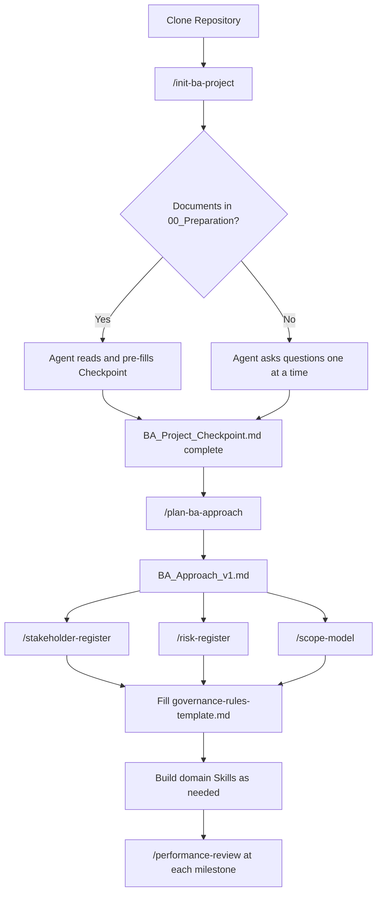

# BA Toolchain Template

A self-extracting Business Analysis environment for the **Antigravity IDE**. Designed to be cloned at the start of any new BA project. Instead of building your workspace from scratch, this toolchain uses an AI agent to guide you through project initialization, scaffold the right artefacts for your context, and apply standing governance rules throughout your engagement.

Built on the **BABOK® Guide v3**, it currently covers **Knowledge Area 1: Business Analysis Planning & Monitoring**.

---

## Prerequisites

- [Antigravity IDE](https://antigravity.dev) (agent slash commands and skill routing required)
- Git

---

## Quickstart

```bash
git clone https://github.com/borysoff/ba-toolchain-template.git my-project-name
cd my-project-name
# Open the folder in Antigravity IDE, then:
```

Then in the IDE chat:

```
/init-ba-project
```

The agent will guide you through the rest.

---

## How It Works

```
/init-ba-project
       │
       ▼
  Reads 00_Preparation/      ← Drop your existing docs here first
       │
       ▼
  Fills BA_Project_Checkpoint.md   ← Central context anchor for all tools
       │
       ▼
  Scaffolds KA folders based on your project needs
```

Once initialized, the BA runs additional tools as the project progresses. Each tool reads the Checkpoint so you never repeat yourself.

---

## Project Structure

```
/
├── 00_Preparation/                 ← Drop SOWs, charters, emails here before init
├── 01_Planning_and_Monitoring/                 ← Generated artefacts land here
├── 02_Elicitation_and_Collaboration/
├── 03_Requirements_Life_Cycle_Management/
├── 04_Strategy_Analysis/
├── 05_Requirements_Analysis_and_Design_Definition/
├── 06_Solution_Evaluation/
├── .agents/
│   ├── workflows/                 ← Slash command scripts
│   ├── skills/skill-template/     ← Copy to create domain compliance skills
│   └── rules/                     ← Standing governance instructions for the agent
├── BA_Project_Checkpoint.md       ← Central context anchor (filled by agent)
└── README.md
```

> **Note:** All 6 KA folders are present in the template by default. The `/init-ba-project` workflow removes the ones not relevant to your project based on your answers.

---

## Tool Reference

### 🚀 Initialization

#### `/init-ba-project`
**File:** `.agents/workflows/init-ba-project.md`

The entry point for every new project.

1. Place any existing documents (Project Charter, SOW, stakeholder emails) into `00_Preparation/`
2. Run `/init-ba-project` in the IDE chat
3. The agent reads your documents first, then asks only for the information that is still missing — **one question at a time**
4. Fills out `BA_Project_Checkpoint.md` across 4 sections: Identity, Stakeholders, Scope, and KA selection
5. Scaffolds the folders for the Knowledge Areas you selected

> **Note:** The agent will not ask about your delivery methodology (Agile/Waterfall/Hybrid). That is a formal output of `/plan-ba-approach`, not an initialization input.

---

### 📋 KA1 Workflows

#### `/plan-ba-approach`
**File:** `.agents/workflows/plan-ba-approach.md`
**Output:** `01_Planning_and_Monitoring/BA_Approach_v1.md`

Run this after initialization to formally determine your delivery methodology.

The agent asks 3 targeted questions about requirements stability, stakeholder change tolerance, and audit requirements. Based on your answers it selects **Predictive**, **Adaptive**, or **Hybrid** and documents the rationale. It also updates the methodology field in your Checkpoint.

```
/plan-ba-approach
```

---

#### `/stakeholder-register`
**File:** `.agents/workflows/stakeholder-register.md`
**Output:** `01_Planning_and_Monitoring/Stakeholder_Register_v1.md`

Builds a structured engagement register from the stakeholder list captured in your Checkpoint.

For each stakeholder, the agent asks about their **influence**, **interest level**, and **current attitude** toward the project. It then auto-calculates the engagement strategy using the standard power/interest grid:

| Influence | Interest | Strategy |
|---|---|---|
| High | High | Manage Closely |
| High | Low | Keep Satisfied |
| Low | High | Keep Informed |
| Low | Low | Monitor |

Sceptics are flagged as resistance risks.

```
/stakeholder-register
```

---

#### `/risk-register`
**File:** `.agents/workflows/risk-register.md`
**Output:** `01_Planning_and_Monitoring/Risk_Register_v1.md`

Guides you through risk identification across 6 standard categories (Stakeholder, Scope, Compliance, Technical, Resource, Governance). For each risk the agent captures likelihood and impact, calculates a risk level (🔴 Critical → 🟢 Low), and suggests a default mitigation strategy. Critical risks are flagged for governance escalation.

```
/risk-register
```

Re-run at any project milestone to refresh and re-score.

---

#### `/scope-model`
**File:** `.agents/workflows/scope-model.md`
**Output:** `01_Planning_and_Monitoring/Scope_Model_v1.md`

Generates a **Mermaid context diagram** — a visual map of your system boundary, all stakeholder groups that interact with the solution, and all external systems it connects to.

The agent asks 3 questions: the system name, which stakeholders directly interact with it, and which external systems it integrates with. The diagram renders automatically in Antigravity IDE.

```
/scope-model
```

---

#### `/performance-review`
**File:** `.agents/workflows/performance-review.md`
**Output:** `01_Planning_and_Monitoring/BA_Performance_Assessment_[Stage].md`

Run at any stage gate or milestone. The agent asks you to define your KPI targets for the stage, then scans the relevant KA folder for produced artefacts and scores performance across Speed, Quality, and Completeness. Generates a KPI Scorecard, Root Cause Analysis for any gaps, and a Lessons Learned register.

```
/performance-review
```

---

### 📋 KA2 Workflows

#### `/prepare-elicitation`
**File:** `.agents/workflows/prepare-elicitation.md`
**Output:** `02_Elicitation_and_Collaboration/Session_Guide_[Stakeholder]_v1.md`

Builds a targeted elicitation session guide for a specific stakeholder. The agent reads context anchors, the Stakeholder Register, and any preparation documents before asking a minimum of questions. Produces a structured guide with pre-session reading list, targeted probe questions (max 8), and a conflict watchlist based on what is already known.

```
/prepare-elicitation
```

> **Note:** If no context anchor exists for the stakeholder yet, the workflow creates one from the `ctx_session_anchor.md` template automatically.

---

#### `/conflict-register`
**File:** `.agents/workflows/conflict-register.md`
**Output:** `02_Elicitation_and_Collaboration/Conflict_Register_v1.md`

Reads one or more raw session transcripts from `02_Elicitation_and_Collaboration/` and synthesizes them against the Project Charter and Checkpoint. Classifies every stakeholder statement as:
- ✅ **Underlying Need** — directly tied to the business problem
- ⚠️ **Stated Want** — preference not directly tied to the core problem
- 🔴 **Potential Conflict** — contradicts another stakeholder or the Charter

```
/conflict-register
```

---

#### `/verify-elicitation`
**File:** `.agents/workflows/verify-elicitation.md`
**Output:** `02_Elicitation_and_Collaboration/Elicitation_Verification_Report_v1.md`

Quality gate before baselining requirements. Checks that every In-Scope area has at least one confirmed elicitation session, every stakeholder has been heard, all blocking conflicts are resolved, and all open questions from context anchors are answered. Issues a clear ✅ / ⚠️ / ❌ verdict.

```
/verify-elicitation
```

---

### 📄 Templates

#### Context Anchor
**File:** `02_Elicitation_and_Collaboration/ctx_session_anchor.md`

The core bounding mechanism for elicitation sessions. Fill one in per stakeholder group before running `/prepare-elicitation`. Captures: stakeholder profile, domain constraints, known conflicts, open questions, and out-of-bounds topics. The agent reads this before generating any session guide or synthesis involving this stakeholder.

Copy and rename to `ctx_[stakeholder_name].md` for each stakeholder.

#### Elicitation Log
**File:** `02_Elicitation_and_Collaboration/Elicitation_Log.md`

The official record of all elicitation sessions, with coverage tracker by In-Scope area. To append a session record via the agent:
```
Log a new session: [stakeholder], [date], [method], [topic]
```

---

#### Issue Log
**File:** `01_Planning_and_Monitoring/Issue_Log.md`

A persistent log for tracking issues, open decisions, and escalations across the project lifecycle. Resolved items are marked Closed rather than deleted to preserve the audit trail.

To add an issue via the agent:
```
Log a new issue: [description of the issue]
```

The agent will append a new row with the next available ID.

---

### 🔧 Extensibility

#### Build a Domain Compliance Skill
**Template:** `.agents/skills/skill-template/`

Use this to package any domain knowledge (regulations, standards, internal policies) into a reusable skill the agent can invoke on demand.

1. Copy the `skill-template/` folder and rename it (e.g., `gdpr_checker/`)
2. Fill in `SKILL.md` — define the skill name, invocation phrase, and evaluation instructions
3. Fill in `DOMAIN_KNOWLEDGE.md` — write the actual rules, standards, and pass/fail criteria
4. The agent will automatically detect and route to the skill when invoked

```
Use the [Skill Name] skill to evaluate this requirement: [paste requirement]
```

> **Architecture note:** Keep `DOMAIN_KNOWLEDGE.md` separate from `SKILL.md`. The skill file tells the agent *how* to evaluate. The knowledge file tells it *what* to evaluate against. This separation makes each file individually maintainable.

---

#### Configure Project Governance Rules
**Template:** `.agents/rules/governance-rules-template.md`

Fill in this file to establish **standing behavioural contracts** for the agent across your entire project. Define what the agent must always do, what it must never do, and which situations require human sign-off before proceeding.

Once completed, rename or copy to `.agents/rules/[your-project]-governance.md`. The agent will treat it as a persistent instruction set for every conversation in this workspace.

Key sections to complete:
- **Standing Instructions** — always-on quality and traceability rules
- **Escalation Triggers** — conditions that must stop the agent and notify you
- **Off-Limits Actions** — hard constraints the agent cannot override
- **Skill Routing Rules** — which tool to invoke for which situation

---

## Workflow Sequence (KA1)



---

## Roadmap

- [x] KA2: Elicitation & Collaboration tools
- [ ] KA3: Requirements Life Cycle Management tools
- [ ] KA4: Strategy Analysis
- [ ] KA5: Requirements Analysis & Design Definition tools
- [ ] KA6: Solution Evaluation

---

## License

MIT
